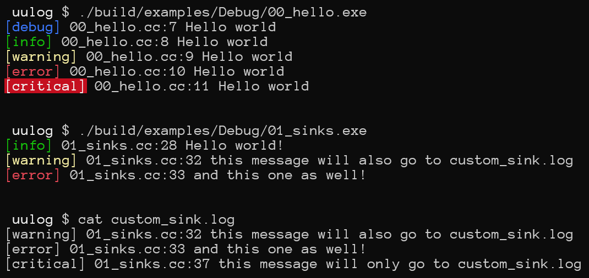

# uμLog
A simple and maybe thread-safe logging library I use across a variety of my personal projects and some projects at work

# How-to
- Have a C++20 compiler (and make MSVC behave with `/Zc:__cplusplus`);  
- Copy the `uulog` directory somewhere and make it compile;  
- Initialize the logger by registering some custom sinks or perhaps using a bunch of built-in ones;  
- Issue log messages!  

# Examples?
1. [Hello World](examples/00_hello.cc)  
2. [Custom Sink](examples/01_sinks.cc)  

# Images
  

# License
- BSD-Zero-Clause  
- [LICENSE](LICENSE)  
