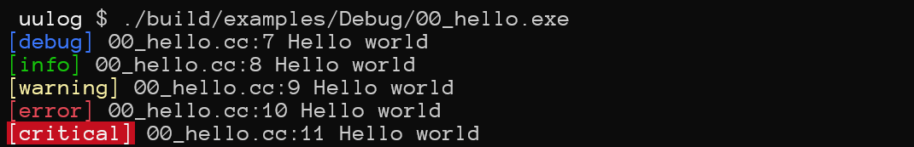
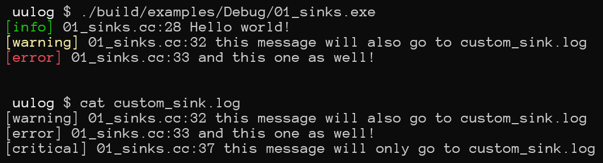

# uμLog
A simple and maybe thread-safe logging library I use across a variety of my personal projects and some projects at work

# HOWTO's
## Copy and forget
- Get a C++20 compiler (or in case of MSVC, [make it behave](https://learn.microsoft.com/en-us/cpp/build/reference/zc-cplusplus))  
- Copy the contents of `uulog` directory somewhere around your project and make sure your source code can include `uulog.hh`  
- Include `uulog.hh` and register some pre-defined sinks or define and use your own  
- Issue log messages: `LOG_DEBUG`, `LOG_INFO`, `LOG_WARNING`, `LOG_ERROR` and `LOG_CRITICAL`  

## CMake: sub-directory
- Clone the repository into your project and remove the sub-repo's `.git` folder  
- Add an `add_subdirectory` call  
- Optionally clean all the unnecessary stuff from both the source tree and CMakeLists.txt  
- Add a dependency on `uulog` library somewhere  
- Include `uulog.hh` and register some pre-defined sinks or define and use your own  
- Issue log messages: `LOG_DEBUG`, `LOG_INFO`, `LOG_WARNING`, `LOG_ERROR` and `LOG_CRITICAL`  

## CMake: FetchContent
```
Under construction
```

# Usage examples
## [Hello World](examples/00_hello.cc)
  

## [Custom Sink](examples/01_sinks.cc)
  

# [Licensing](LICENSE)
```
Permission to use, copy, modify, and/or distribute this software for any
purpose with or without fee is hereby granted.

THE SOFTWARE IS PROVIDED "AS IS" AND THE AUTHOR DISCLAIMS ALL WARRANTIES WITH
REGARD TO THIS SOFTWARE INCLUDING ALL IMPLIED WARRANTIES OF MERCHANTABILITY
AND FITNESS. IN NO EVENT SHALL THE AUTHOR BE LIABLE FOR ANY SPECIAL, DIRECT,
INDIRECT, OR CONSEQUENTIAL DAMAGES OR ANY DAMAGES WHATSOEVER RESULTING FROM
LOSS OF USE, DATA OR PROFITS, WHETHER IN AN ACTION OF CONTRACT, NEGLIGENCE OR
OTHER TORTIOUS ACTION, ARISING OUT OF OR IN CONNECTION WITH THE USE OR
PERFORMANCE OF THIS SOFTWARE.
```


# Remarks
## Performance impact
**I do not debug with std::format, I do not use print debugging in high call-rate functions, I do not profile a logger. If something runs slow because of a bunch of `LOG_INFO` statements, _I comment them out_**  
  

## Using across different DLLs
- Compile uulog as a shared library via `BUILD_SHARED_LIBS`  
- Define `UULOG_DLL` for dependent projects  

## Thread safety
The for-each loop for every `uulog::Sink` registered into the logger is wrapped with an internal mutex (the exact same one used to register and de-register sinks) so the sink is to assume it is safe to access a resource  

## NDEBUG
Whenever `NDEBUG` is defined, the compiled library doesn't provide `uulog::detail::debug` function nor does `LOG_DEBUG` do anything apart from being pre-processed as `((void)0)`  
